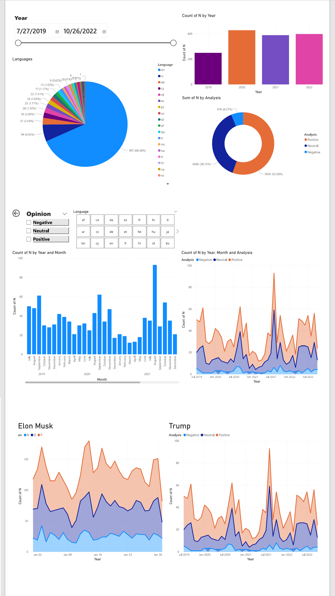

# Data-Analytics-Project

## Extract and sentiment analysis on social media :one::

- Put your **URL** Youtube video
- Put **number** of comments you need (you can select all of them)
- **optionally**:rose: Choose specific name for Excel file(if you don't do it the file name automatically will be putin)
  **Finally, you have an Excel file containing all of these details** :boom::smiley:

|     | Variable     | Explanation                                                  |
| --: | :----------- | :----------------------------------------------------------- |
|   0 | title        | Number                                                       |
|   1 | Comment-Text | Display text                                                 |
|   2 | Year         | The Year when the comment                                    |
|   3 | Hour_z_time  | The Houre when the comment written                           |
|   4 | Analysis     | Comment Type P when it's Positive, N Negative, and O Neutral |
|   5 | Language     | The Languege of the comment                                  |

## Data visualization :loop: using Power Bi :two: :

[Click here](https://drive.google.com/drive/folders/1O89DGOIu7uH4DitKLcaCsZGTO_blpdWh?usp=share_link)

##internet new in data_camp 

